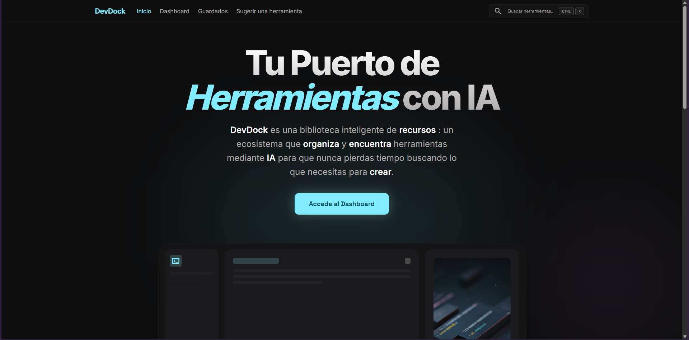
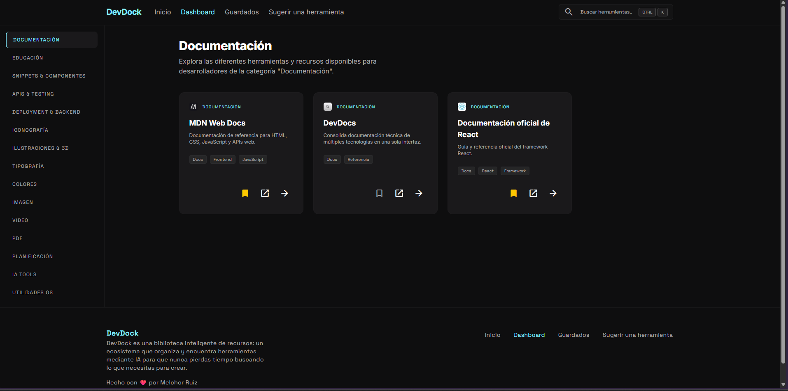
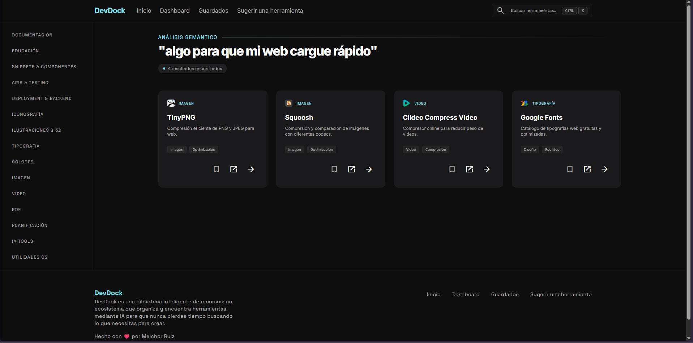
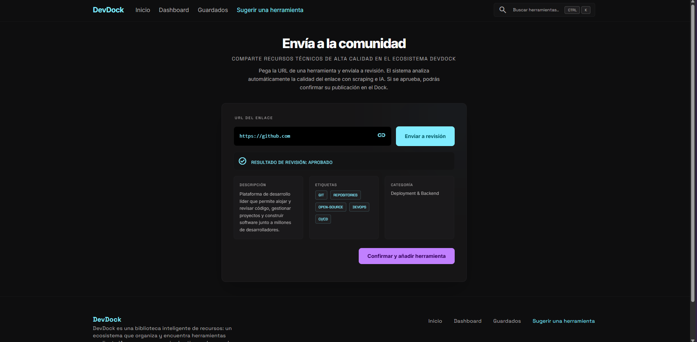

# DevDock

    

## Descripcion del proyecto
DevDock es una biblioteca web de herramientas para desarrolladores que combina catálogo por categorías, búsqueda semántica con IA y un flujo de sugerencias asistido por scraping e inteligencia artificial. La app permite descubrir herramientas técnicas, revisar detalles de cada recurso y guardar favoritos en el navegador. Además, incluye un proceso de revisión de nuevas URLs sugeridas por los propios usuarios mediante scraping e inteligencia artificial para validar si realmente aportan valor al ecosistema de desarrollo.

## Demo
[devdock.melchor-ruiz.dev](https://devdock.melchor-ruiz.dev)

## Capturas de pantalla

## Como se usa CubePath
Se usa el servicio de VPS de CubePath para el despliegue de la app.
